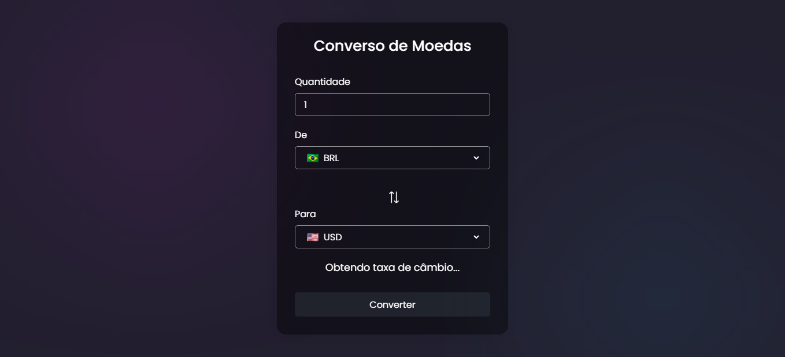

# Conversor de moedas
Este projeto é um conversor de moedas desenvolvido com HTML, CSS e JavaScript, utilizando a API Exchangerate para obter taxas de câmbio. O projeto é totalmente responsivo e inclui ícones de bandeiras usando Api para cada moeda, proporcionando uma interface de usuário intuitiva e visualmente atraente.

#### Link do site em funcionamento: <a href="https://conversormoedas1934.netlify.app/"> Clique aqui </a>

## Aviso
Você precisa obter sua própria chave de API (no vídeo mostramos como!) e substituí-la em index.js arquivo na linha 59:

const response = await fetch(`https://v6.exchangerate-api.com/v6/[YOUR_KEY]]/latest/${fromCur.value}`);

```javascript
const response = await fetch(`https://v6.exchangerate-api.com/v6/[YOUR_KEY]]/latest/${fromCur.value}`);
```
## Funcionalidades
 * Conversão de valores entre diferentes moedas;
 * Atualização automática de taxas de câmbio utilizando a API Exchangerate;
 * Interface de usuário responsiva;
 * Ícones de bandeira para cada moeda, utilizando uma API de ícones de bandeira;

## Tecnologias
- HTML
- CSS
- JavaScript
- API Exchangerate
- API de Ícones de Bandeira

# Screenshot
Aqui temos a captura de tela do projeto:

 
